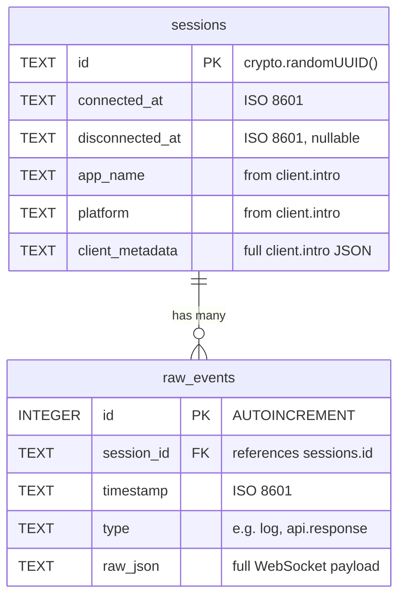

# Migrate Storage from JSONL to SQLite with Raw-First Ingestion

## Overview

Replace the JSONL flat-file storage with SQLite using `bun:sqlite`. Adopt a raw-first architecture: store raw Reactotron WebSocket payloads directly with minimal processing at ingestion time. Curation (the `curateEvent()` pipeline) moves to read-time. Extract shared types and curation logic into a module used by both server and dashboard.

## Proposed Solution

### Architecture Change

```
BEFORE (write-heavy):
  WebSocket message → curateEvent() → append to JSONL → broadcast curated

AFTER (read-heavy):
  WebSocket message → extract 3 fields → INSERT raw row → broadcast curated
                                                            ↑
  GET /api/events → SELECT raw rows → curateEvent() each → return CuratedEvent[]
```

### SQL Schema

```sql
CREATE TABLE sessions (
  id TEXT PRIMARY KEY,                              -- crypto.randomUUID()
  connected_at TEXT NOT NULL,                       -- ISO 8601
  disconnected_at TEXT,                             -- ISO 8601, NULL while connected
  app_name TEXT,                                    -- from client.intro payload
  platform TEXT,                                    -- from client.intro payload
  client_metadata TEXT                              -- full client.intro JSON for future use
);

CREATE TABLE raw_events (
  id INTEGER PRIMARY KEY AUTOINCREMENT,             -- stable ordering tiebreaker
  session_id TEXT NOT NULL REFERENCES sessions(id),
  timestamp TEXT NOT NULL,                          -- ISO 8601, set at ingestion
  type TEXT NOT NULL,                               -- e.g. "log", "api.response"
  raw_json TEXT NOT NULL                            -- full WebSocket payload as JSON string
);

CREATE INDEX idx_events_timestamp ON raw_events(timestamp);
CREATE INDEX idx_events_session ON raw_events(session_id);
CREATE INDEX idx_events_type ON raw_events(type);
```

### Key Design Decisions

| Decision | Choice | Rationale |
|---|---|---|
| Schema | `sessions` + `raw_events` tables | Light normalization; sessions are a natural grouping |
| Ingestion metadata | timestamp, session_id, type only | Raw-first: everything else is read-time curation |
| SQLite driver | `bun:sqlite` | Zero dependencies, built into the runtime |
| `client.intro` | Do NOT drop; store as raw event + populate session metadata | Only source of app name/platform |
| `shouldDrop()` at ingestion | Yes, but without `client.intro` | Still drop ping/pong/heartbeat/connected noise |
| Curation location | Shared module, called at read-time by server API | Eliminates type duplication between server and dashboard |
| Dashboard WebSocket | Continue sending curated events | No dashboard changes needed for WebSocket handling |
| State snapshots | Keep as `state.json` file | Avoids scope creep; dump-state is request/response, not event-driven |
| API contract | Preserved — `GET /api/events` returns `CuratedEvent[]` | Backward compatible with Claude skill and other consumers |
| JSONL migration | Clean break, no import | Debugging data is ephemeral |
| DB location | `.reactotron-llm/reactotron.db` | Same directory, already gitignored |
| Orphaned sessions | Close on startup | `UPDATE sessions SET disconnected_at = ... WHERE disconnected_at IS NULL` |

## Technical Approach

### Implementation Phases

#### Phase 1: Extract shared curation module

Create `src/shared/` with the curation pipeline extracted from `src/index.ts`.

**Files to create:**

- **`src/shared/types.ts`** — `CuratedEvent` type, `JsonObject` type, any shared interfaces
- **`src/shared/curate.ts`** — `curateEvent(payload, timestamp)`, all helper functions (`firstString`, `firstNumber`, `firstValue`, `getByPath`, `deepFindByKeys`, `extractNetwork`, `extractDetails`, `getMessageType`, `getMessageLevel`, `normalizeActionPayload`, `formatActionDisplayName`, `maybeParseJsonString`, `asObject`)

**Changes to `curateEvent()` signature:**

```typescript
// BEFORE (src/index.ts:460)
function curateEvent(payload: unknown): CuratedEvent | null

// AFTER (src/shared/curate.ts)
function curateEvent(payload: unknown, timestamp: string): CuratedEvent | null
```

- Remove `new Date().toISOString()` from inside the function; use the `timestamp` parameter
- Remove `shouldDrop()` call from inside `curateEvent()` — dropping happens at ingestion, before curation
- `curateEvent()` returns `null` only when the event has no useful fields (no message, stack, network, action, benchmark, or details)

**Changes to `shouldDrop()`:**

```typescript
// BEFORE
function shouldDrop(type: string): boolean {
  const t = type.toLowerCase()
  return (
    t.includes('ping') || t.includes('pong') || t.includes('heartbeat') ||
    t.includes('connected') || t.includes('client.intro')
  )
}

// AFTER — remove client.intro from the list
function shouldDrop(type: string): boolean {
  const t = type.toLowerCase()
  return (
    t.includes('ping') || t.includes('pong') || t.includes('heartbeat') ||
    t.includes('connected')
  )
}
```

`shouldDrop()` stays in `src/index.ts` (server-only, ingestion concern) — it is NOT part of the shared module.

**Files to modify:**

- **`src/index.ts`** — Remove extracted functions/types, import from `src/shared/`
- **`dashboard/src/App.tsx`** — Remove duplicated `CuratedEvent` type, import from shared module

**Dashboard Vite config:**

Add a resolve alias in `dashboard/vite.config.ts` so the dashboard can import from `../../src/shared/`:

```typescript
resolve: {
  alias: {
    '@shared': path.resolve(__dirname, '../src/shared'),
  },
}
```

**Success criteria:**
- [x] Server compiles and runs with shared module imports
- [x] Dashboard compiles and runs with shared module imports
- [x] `CuratedEvent` type exists in exactly one place (`src/shared/types.ts`)
- [x] All existing API responses are identical (no behavioral change)

---

#### Phase 2: Add SQLite storage layer

Create the database module and wire it into the server.

**Files to create:**

- **`src/db.ts`** — Database initialization, prepared statements, read/write functions

**`src/db.ts` responsibilities:**

```typescript
import { Database } from "bun:sqlite";

// Initialization
export function initDb(dbPath: string): Database
//   - CREATE TABLE IF NOT EXISTS sessions (...)
//   - CREATE TABLE IF NOT EXISTS raw_events (...)
//   - CREATE INDEX IF NOT EXISTS ...
//   - PRAGMA journal_mode = WAL
//   - PRAGMA synchronous = NORMAL
//   - PRAGMA foreign_keys = ON
//   - Close orphaned sessions: UPDATE sessions SET disconnected_at = ? WHERE disconnected_at IS NULL

// Session management
export function createSession(db: Database, sessionId: string): void
export function updateSessionMetadata(db: Database, sessionId: string, metadata: { appName?: string; platform?: string; raw?: unknown }): void
export function closeSession(db: Database, sessionId: string): void

// Event storage
export function insertRawEvent(db: Database, event: { sessionId: string; timestamp: string; type: string; rawJson: string }): void

// Event retrieval
export function getRecentEvents(db: Database, limit: number): Array<{ id: number; timestamp: string; type: string; raw_json: string }>
//   - SELECT id, timestamp, type, raw_json FROM raw_events ORDER BY id DESC LIMIT ?
//   - Returns in reverse chronological order; caller reverses for chronological

// Reset
export function deleteAllEvents(db: Database): void
//   - DELETE FROM raw_events
```

Use **prepared statements** for `insertRawEvent` and `getRecentEvents` (the hot paths). `bun:sqlite` supports `db.prepare(sql)` which compiles once and executes many times.

**Single connection model:** Open one `Database` instance at startup, keep it open for the server's lifetime. WAL mode handles concurrent reads from the API while the WebSocket handler writes.

**Files to modify:**

- **`src/index.ts`** — Replace JSONL read/write with `src/db.ts` calls

**Specific changes in `src/index.ts`:**

| Current code | Replacement |
|---|---|
| `APP_LOG_PATH` constant | `DB_PATH = path.join(OUTPUT_DIR, 'reactotron.db')` |
| `setupStorage()` — `mkdir` only | Add `initDb(DB_PATH)` call |
| `appendEvent()` — curate + appendFile + broadcast | Extract type, check `shouldDrop()`, `insertRawEvent()`, curate for broadcast, `broadcastDashboard()` |
| `loadRecentEvents()` — read entire JSONL | `getRecentEvents()` + `curateEvent()` on each row |
| `POST /api/events/reset` — truncate file | `deleteAllEvents()` |
| `wsBehavior().onOpen` — add to Set | Also `createSession()` |
| `wsBehavior().onClose` — remove from Set | Also `closeSession()` |
| `wsBehavior().onMessage` — parse + appendEvent | Parse, extract type, handle `client.intro` for session metadata, check `shouldDrop()`, `insertRawEvent()`, curate + broadcast |
| `AppWsData` type `{ clientId }` | Add `sessionId` field |

**`client.intro` handling in `onMessage`:**

```typescript
// After parsing the message and extracting the type:
if (type === 'client.intro') {
  const payload = asObject(getByPath(parsed, 'payload'))
  updateSessionMetadata(db, sessionId, {
    appName: firstString(parsed, ['payload.name', 'payload.appName', 'name']),
    platform: firstString(parsed, ['payload.platform', 'platform']),
    raw: payload,
  })
}
// Then proceed to normal ingestion (insertRawEvent) — client.intro is NOT dropped
```

**Revised `appendEvent` flow (renamed conceptually):**

```typescript
// In onMessage handler:
const type = getMessageType(parsed)
if (shouldDrop(type)) return                    // Drop protocol noise (but NOT client.intro)

const timestamp = new Date().toISOString()
insertRawEvent(db, { sessionId, timestamp, type, rawJson: JSON.stringify(parsed) })

const curated = curateEvent(parsed, timestamp)  // Curate for live broadcast only
if (curated) {
  broadcastDashboard({ kind: 'event', event: curated })
}

const maybeState = inferState(parsed)           // State inference unchanged
if (maybeState !== null) {
  latestState = maybeState
  latestStateAt = timestamp
  writeFile(STATE_PATH, JSON.stringify(maybeState, null, 2), 'utf8').catch(() => {})
}
```

**Revised `GET /api/events` handler:**

```typescript
app.get('/api/events', (c) => {
  const limit = Math.min(Number(c.req.query('limit') ?? 200), 2000)
  const rows = getRecentEvents(db, limit)

  const events: CuratedEvent[] = []
  for (const row of rows) {
    try {
      const curated = curateEvent(JSON.parse(row.raw_json), row.timestamp)
      if (curated) events.push(curated)
    } catch { /* skip malformed rows */ }
  }

  // Reverse to chronological order (getRecentEvents returns newest first)
  events.reverse()

  return c.json({ ok: true, count: events.length, events })
})
```

**Success criteria:**
- [x] Server starts and creates `.reactotron-llm/reactotron.db` with correct schema
- [x] Connecting an app client creates a session row
- [x] Incoming events are stored as raw rows with correct session_id, timestamp, type
- [x] `client.intro` populates session metadata AND is stored as a raw event
- [x] `GET /api/events` returns `CuratedEvent[]` (same shape as before)
- [x] `POST /api/events/reset` clears all events
- [x] Dashboard live updates still work (curated events over WebSocket)
- [x] Disconnecting the app updates the session's `disconnected_at`
- [x] Server restart closes orphaned sessions

---

#### Phase 3: Clean up and update documentation

**Files to modify:**

- **`src/index.ts`** — Remove dead JSONL code (`APP_LOG_PATH`, old `appendEvent`, old `loadRecentEvents`, old `setupStorage` file-only logic)
- **`README.md`** — Update "Output files" section: mention `reactotron.db` instead of `app-log.jsonl`
- **`.claude/reactotron/references/event-format.md`** — Update line referencing JSONL file to reference SQLite
- **`.claude/reactotron/SKILL.md`** — Update any references to JSONL storage (the skill already prefers API over file, so changes should be minimal)

**Optional: warn about old JSONL file.** On startup, if `app-log.jsonl` exists, log a one-time message:

```
[reactotron-llm] Found legacy app-log.jsonl — storage has moved to reactotron.db. You can safely delete app-log.jsonl.
```

**Success criteria:**
- [x] No references to JSONL in server code
- [x] README accurately describes the storage
- [x] Claude skill references are up to date
- [ ] `.claude/reactotron.skill` archive is rebuilt if needed

---

## Acceptance Criteria

### Functional Requirements

- [x] Raw WebSocket payloads are stored in SQLite with timestamp, session_id, and type
- [x] `GET /api/events?limit=N` returns `CuratedEvent[]` (same schema as today)
- [x] `POST /api/events/reset` clears all stored events
- [x] `GET /health` works as before
- [x] `GET /dump-state` and `GET /api/state` work as before (state.json unchanged)
- [x] Dashboard shows live events via WebSocket
- [x] Dashboard loads initial events via `GET /api/events`
- [x] Sessions are created on WebSocket connect and closed on disconnect
- [x] `client.intro` metadata populates the sessions table
- [x] Orphaned sessions are closed on server startup
- [x] Protocol noise (ping, pong, heartbeat, connected) is dropped before storage
- [x] `client.intro` is NOT dropped — it is stored and used for session metadata

### Non-Functional Requirements

- [x] Zero new dependencies (uses `bun:sqlite` built-in)
- [x] WAL mode enabled for concurrent read/write
- [x] `CuratedEvent` type defined in exactly one place (shared module)
- [x] Prepared statements used for hot-path queries (insert, select recent)

## Dependencies & Risks

**Dependencies:**
- Bun >= 1.1.0 (already required; `bun:sqlite` has been stable since Bun 1.0)

**Risks:**
- **Read-time curation performance**: Running `curateEvent()` on 200-2000 rows per API call adds latency vs. the current pre-curated JSONL reads. For a local debugging tool this should be fine, but measure if it exceeds ~200ms.
- **Dashboard Vite alias**: Importing from outside the dashboard `src/` directory requires Vite configuration. If this proves fragile, fall back to a symlink or copying the shared types.

## Out of Scope (Future Considerations)

- Cursor-based pagination (`?after=<id>` or `?since=<timestamp>`)
- Session-scoped event queries (`?session_id=...`)
- State snapshots in SQLite
- Data retention / automatic pruning
- Raw event API endpoint (`/api/events/raw`)
- Curation result caching
- `/health` reporting database stats

## References

- Brainstorm: `docs/brainstorms/2026-03-03-sqlite-migration-brainstorm.md`
- Issue: [#1](https://github.com/micheleb/reactotron-llm/issues/1)
- Server (all current logic): `src/index.ts`
- Dashboard UI: `dashboard/src/App.tsx`
- Claude skill: `.claude/reactotron/SKILL.md`
- Event format reference: `.claude/reactotron/references/event-format.md`


