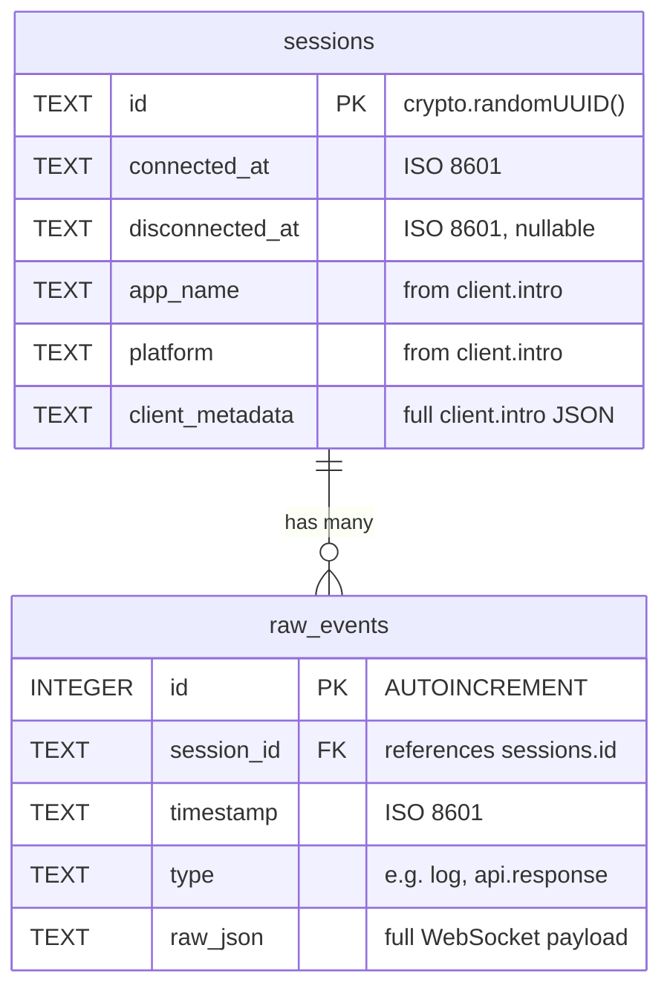

# Add Historical Log Browser to Web Dashboard

## Overview

Add a "History" tab to the dashboard that lets users browse past sessions stored in SQLite, grouped by Date → Client App → Session. Clicking a session opens a full-page view with virtualized event rendering using `react-virtuoso`. The existing live event stream becomes the "Live" tab. This makes historical data a first-class, immediately discoverable feature.

## Proposed Solution

### Architecture

```
Dashboard Views:

  ┌──────────────────────────────────────┐
  │  [Live]  [History]                   │  ← Tab bar (always visible)
  ├──────────────────────────────────────┤
  │                                      │
  │  Live Tab:     existing behavior     │
  │  History Tab:  session tree browser  │
  │  Session View: full-page takeover    │
  │                                      │
  └──────────────────────────────────────┘

View State Machine:

  { tab: 'live' }
  { tab: 'history', view: 'list' }
  { tab: 'history', view: 'session', sessionId: string }
```

### New API Endpoints

```
GET /api/sessions
  → { ok: true, sessions: Session[] }
  Session: { id, connected_at, disconnected_at, app_name, platform, event_count }
  Ordered by connected_at DESC. Flat array; frontend handles grouping.

GET /api/sessions/:id/events
  → { ok: true, total: number, events: CuratedEvent[] }
  Returns ALL curated events for the session in chronological order (oldest first).
  404 if session not found: { ok: false, error: "Session not found" }
```

### Key Design Decisions

| Decision | Choice | Rationale |
|---|---|---|
| UI pattern | Tab bar ("Live" / "History") | Clean separation, immediately discoverable |
| Session grouping | Date → App+Platform → Session | Natural hierarchy using existing session metadata |
| Session event view | Full-page takeover with back button | Maximizes screen space for event inspection |
| Virtualization | `react-virtuoso` | Handles variable-height event cards (accordions) automatically |
| Data loading | Fetch all session events at once | Dev tool sessions rarely exceed a few thousand events; simplifies filtering |
| Filtering | Client-side (same as Live tab) | Consistent pattern; works naturally with all-at-once loading |
| Date grouping timezone | Browser local timezone | Most intuitive for developers |
| Session date assignment | Group by `connected_at` date | Sessions spanning midnight appear under their start date |
| NULL app_name | Show "Unknown App" | Graceful fallback for sessions without client.intro |
| Event order in History | Chronological (oldest first) | Natural for reading logs as a timeline |
| State Snapshot panel | Hidden on History tab | Only meaningful for live sessions |
| Reset Logs button | Live tab only | Prevents accidental destruction of historical data |
| Session list refresh | Manual only (no auto-refresh) | Simplest approach; can add WebSocket notifications later |
| URL routing | None (React state only) | Matches current single-page pattern; can add later |

## Technical Approach

### Implementation Phases

#### Phase 1: Backend — New database queries and API endpoints

Add session listing and session-scoped event retrieval to the storage and API layers.

**Files to modify:**

- **`src/db.ts`** — Add two new query functions

```typescript
// New: List all sessions with event counts
export function listSessions(db: Database): Array<{
  id: string
  connected_at: string
  disconnected_at: string | null
  app_name: string | null
  platform: string | null
  event_count: number
}>
// SQL: SELECT s.*, COUNT(e.id) as event_count
//      FROM sessions s
//      LEFT JOIN raw_events e ON e.session_id = s.id
//      GROUP BY s.id
//      ORDER BY s.connected_at DESC

// New: Get all events for a specific session
export function getSessionEvents(db: Database, sessionId: string): Array<{
  id: number
  timestamp: string
  type: string
  raw_json: string
}>
// SQL: SELECT id, timestamp, type, raw_json
//      FROM raw_events
//      WHERE session_id = ?
//      ORDER BY id ASC
```

Both queries should use prepared statements cached in the existing `stmtCache` WeakMap pattern.

- **`src/index.ts`** — Add two new Hono routes

```typescript
// GET /api/sessions — List all sessions with metadata
app.get('/api/sessions', (c) => {
  const sessions = listSessions(db)
  return c.json({ ok: true, sessions })
})

// GET /api/sessions/:id/events — Get all events for a session
app.get('/api/sessions/:id/events', (c) => {
  const sessionId = c.req.param('id')
  const rows = getSessionEvents(db, sessionId)
  if (rows.length === 0) {
    // Check if session exists at all
    // If not, return 404
  }
  const events: CuratedEvent[] = []
  for (const row of rows) {
    try {
      const curated = curateEvent(JSON.parse(row.raw_json), row.timestamp)
      if (curated) events.push(curated)
    } catch { /* skip malformed */ }
  }
  return c.json({ ok: true, total: events.length, events })
})
```

Also: merge offset support from `feat/load-more-events` into `getRecentEvents` if not already present, since the worktree is based on `main`.

**Success criteria:**
- [x] `GET /api/sessions` returns sessions with `event_count` per session
- [x] `GET /api/sessions/:id/events` returns curated events for a specific session
- [x] 404 returned for non-existent session IDs
- [x] Existing `/api/events` endpoint unchanged
- [x] Prepared statements cached for new queries

---

#### Phase 2: Frontend — Extract reusable components from App.tsx

Before adding the History tab, decompose the monolithic `App.tsx` into reusable components.

**Files to create:**

- **`dashboard/src/components/EventCard.tsx`** — Extract event card rendering
  - Source: `App.tsx` lines ~323-458 (the inline event card JSX)
  - Props: `{ event: CuratedEvent }`
  - Includes: type badge, primary label, timestamp, message, action accordion, network tabs, stack trace
  - Reused by both Live tab and History session detail view

- **`dashboard/src/components/FilterBar.tsx`** — Extract filter controls
  - Source: `App.tsx` lines ~274-316 (filter dropdowns and inputs)
  - Props: `{ typeFilter, levelFilter, urlFilter, errorsOnly, eventTypes, onTypeFilterChange, onLevelFilterChange, onUrlFilterChange, onErrorsOnlyChange, onReset }`
  - Reused by both Live tab and History session detail view

**Files to modify:**

- **`dashboard/src/App.tsx`** — Replace inline event cards and filters with imported components

**Success criteria:**
- [x] `EventCard` renders identically to the current inline version
- [x] `FilterBar` renders identically to the current inline version
- [x] Dashboard looks and works exactly as before after extraction
- [x] No behavioral changes

---

#### Phase 3: Frontend — Add tab bar and History session list

Add the Chakra UI `Tabs` wrapper and build the History tab with grouped session tree.

**Files to create:**

- **`dashboard/src/components/SessionTree.tsx`** — Grouped session browser
  - Fetches `GET /api/sessions` on mount
  - Groups sessions: Date → (app_name, platform) → Session
  - Date groups: "Today", "Yesterday", or formatted date (e.g. "Mar 4")
  - Uses browser local timezone for date computation
  - Today's group expanded by default
  - Each session row shows: time range, event count, active badge if `disconnected_at` is null
  - NULL `app_name` displayed as "Unknown App"
  - Props: `{ apiBase: string, onSelectSession: (sessionId: string) => void }`

**Files to modify:**

- **`dashboard/src/App.tsx`** — Wrap content in Chakra `Tabs`
  - Tab bar with "Live" and "History" tabs sits below the header
  - Live tab: existing event stream + state panel + stats + filters
  - History tab: `<SessionTree>` component
  - Connection settings and header bar remain above tabs (shared)
  - Stats grid stays in Live tab only
  - State Snapshot panel hidden when History tab is active
  - "Reset Logs" button visible only on Live tab

**New state in App.tsx:**

```typescript
type ViewState =
  | { tab: 'live' }
  | { tab: 'history'; view: 'list' }
  | { tab: 'history'; view: 'session'; sessionId: string }

const [viewState, setViewState] = useState<ViewState>({ tab: 'live' })
```

**Success criteria:**
- [x] Tab bar appears with "Live" and "History" tabs
- [x] Live tab contains all existing functionality
- [x] History tab shows grouped session tree
- [x] Sessions grouped by date → app+platform → individual session
- [x] Today's date group is expanded by default
- [x] Active sessions show visual indicator
- [x] "Reset Logs" only appears on Live tab
- [x] State Snapshot panel hidden on History tab

---

#### Phase 4: Frontend — Session detail view with virtual scrolling

Build the full-page session detail view with `react-virtuoso`.

**Dependencies to add:**

```bash
cd dashboard && bun add react-virtuoso
```

**Files to create:**

- **`dashboard/src/components/SessionDetail.tsx`** — Full-page session event viewer
  - Header: back button, app name, platform, time range, event count
  - Filter bar (independent filter state from Live tab)
  - `react-virtuoso` `Virtuoso` component rendering `EventCard` for each event
  - Fetches `GET /api/sessions/:id/events` on mount
  - Client-side filtering on the full event array
  - Events displayed in chronological order (oldest first)
  - Loading state while fetching
  - Empty state if session has no events
  - Error state if fetch fails (with retry button)

**Integration with App.tsx view state:**

```typescript
// When viewState is { tab: 'history', view: 'session', sessionId }:
//   Render <SessionDetail> instead of the tab content
//   Tab bar remains visible at top so user can switch to Live

// Back button sets viewState to { tab: 'history', view: 'list' }
```

**react-virtuoso usage:**

```tsx
import { Virtuoso } from 'react-virtuoso'

<Virtuoso
  data={filteredEvents}
  itemContent={(index, event) => <EventCard event={event} />}
  style={{ height: '65vh' }}
/>
```

`react-virtuoso` measures item heights automatically — no fixed heights or estimation needed. Accordion expand/collapse within `EventCard` is handled naturally.

**Success criteria:**
- [x] Clicking a session in the tree opens full-page session detail
- [x] Session header shows metadata (app name, platform, time range, event count)
- [x] Back button returns to session list
- [x] Events rendered via `react-virtuoso` with smooth scrolling
- [x] Filters work independently from Live tab filters
- [x] Empty state shown for sessions with zero events
- [x] Error state with retry button if API call fails
- [x] Tab bar visible during session detail view

---

## Acceptance Criteria

### Functional Requirements

- [x] Dashboard has "Live" and "History" tabs
- [x] Live tab preserves all existing behavior (events, filters, state, WebSocket)
- [x] History tab shows sessions grouped by Date → App+Platform → Session
- [x] Session tree shows event count per session
- [x] Active sessions visually distinguished from closed sessions
- [x] Clicking a session opens full-page event viewer
- [x] Session event viewer uses virtual scrolling for smooth performance
- [x] Session event viewer has independent filter controls
- [x] Back button returns to session list
- [x] `GET /api/sessions` returns all sessions with event counts
- [x] `GET /api/sessions/:id/events` returns curated events for a session
- [x] "Reset Logs" button only visible on Live tab
- [x] State Snapshot panel only visible on Live tab

### Non-Functional Requirements

- [x] One new dependency only: `react-virtuoso`
- [x] Event card component reused between Live and History views (no duplication)
- [x] Prepared statements used for new database queries
- [x] Session list loads in under 500ms for 100+ sessions

## Dependencies & Risks

**Dependencies:**
- `react-virtuoso` — mature, well-maintained library for variable-height virtualized lists
- Existing `sessions` and `raw_events` tables with indexes (already in place)

**Risks:**
- **Large sessions:** Fetching all events for a session with 50k+ events could be slow. Acceptable for a dev tool; can add pagination later if needed.
- **App.tsx decomposition:** Extracting components from the monolithic file requires care to preserve exact behavior. Test manually after extraction.
- **react-virtuoso bundle size:** Adds ~30KB gzipped. Acceptable for a dev tool dashboard.

## Out of Scope

- Text search / full-text search across events
- Cross-session event search
- Data export
- Data retention / pruning policies
- Calendar-based navigation
- URL routing / deep links to sessions
- Keyboard navigation in session tree
- Auto-refresh of session list via WebSocket
- Event type breakdown per session in tree view
- Server-side filtering for session events

## References

- Brainstorm: `docs/brainstorms/2026-03-06-historical-log-browser-brainstorm.md`
- Issue: [#9](https://github.com/micheleb/reactotron-llm/issues/9)
- Database layer: `src/db.ts`
- Server API: `src/index.ts`
- Dashboard UI: `dashboard/src/App.tsx`
- Shared types: `src/shared/types.ts`
- Curation pipeline: `src/shared/curate.ts`
- Previous plan (format reference): `docs/plans/2026-03-03-feat-sqlite-raw-first-storage-plan.md`


